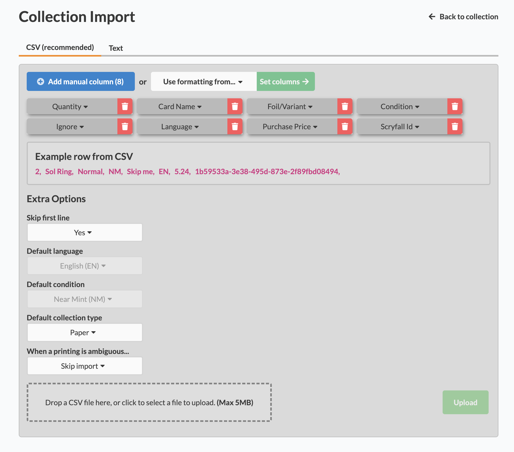

# Cardmarket to Archidekt

**Not tested on windows**

## Requirements / Installation

1. [UV](https://docs.astral.sh/uv/getting-started/installation/)

- If you have homebrew, you can install with `brew install uv`
- Alternatively, run `curl -LsSf https://astral.sh/uv/install.sh | sh`

2. Install dependencies with `uv sync`

Semi-automated tool to import Cardmarket purchases into Archidekt collection

### Features

- Process any amount of orders at once, producing a single CSV file for import
- Fetches card info from Scryfall API by the Cardmarket product ID scraped from downloaded HTML pages
- Automatically fetches current EUR to USD exchange rate from the European Central Bank (ECB) API

### Usage

1. Save HTML pages from e.g. `https://www.cardmarket.com/en/Magic/Orders/Purchases/Sent` to `./data/input`
2. Run with main.py (**from this directory**, `uv run main.py`)
3. At the archidekt [import page](https://archidekt.com/collections/import), set up the following columns. (click **"Add manual column"** 8 times, then modify the last one to say "Scryfall Id")  
   
4. Upload or drag the generated CSV (located at `data/records/`)

### TODO

- Automate HTML downloads
