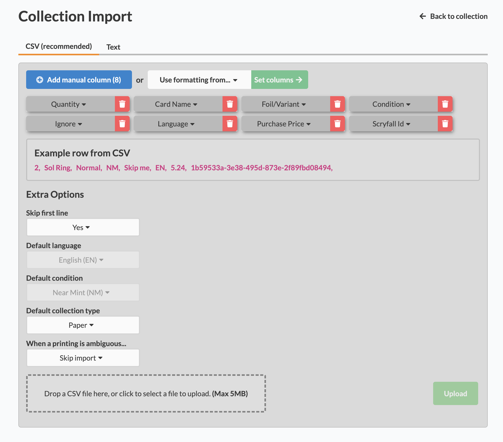

# Cardmarket to Archidekt

Semi-automated tool to import Cardmarket purchases into Archidekt collection

**Not tested on windows**

## Features

- Process any amount of orders at once, producing a single CSV file for import
- Fetches card info from Scryfall API by the Cardmarket product ID scraped from downloaded HTML pages
- Automatically fetches current EUR to USD exchange rate from the European Central Bank (ECB) API

## Requirements

- Python 3.13^ (might work on earlier versions)
- Install required packages with `pip install -r requirements.txt`

## Usage

1. Save HTML pages from e.g. `https://www.cardmarket.com/en/Magic/Orders/Purchases/Sent` to `./data/input`
2. Run with main.py (**from this directory**, `python main.py`)
3. At the archidekt [import page](https://archidekt.com/collections/import), click 'Add manual column' 8 times. Then, modify the fifth and last column, to "ignore" and "Scryfall ID", respectively. Set the following coloumns, as such:
   

4. Drag the csv from `output/..`, done

## TODO

- Change to one of the preset column formats on Archidekt
- Automate HTML downloads
